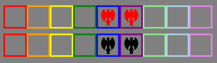
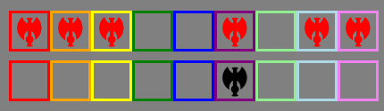

# Loading Package Resources Files

One of the big things that has changed as part of Windows 8.X/10 is the application package infrastructure.  Where all the files and folders that you deploy with your application are actually located.  And along with that, the method for loading files from a C# application have changed pretty drastically.  The new C# APIs are thin wrappers around the underlying Windows Store application APIs in order to manage the sandboxing of everything effectively.

## Package Install Location

The entire UWP is deployed as a package.  You can get information about the currently executing package using `Windows.ApplicationModel.Package.Current`, and the package location can be retrieved with the `InstalledLocation` property.  When you're debugging, the package location will be something like `$(OutputPath)\AppX`.  

For the most part, resources that you include in your project (i.e. items that you set **Build Action** to *Content* for), will just be directly in this folder.  Any resources that are pulled in as part of another dependency you reference each get their own folder.  For example, for the library **CoreLibrary** you could have a file called `C:\Sample\bin\x64\Debug\AppX\CoreLibrary\Images\thing.png`.

## Resource URIs

Within a UWP, you can access any resources in the package using the `ms-appx://` protocol, but the format of the paths is a little odd.  For the sample resource name defined above, you would use:

    ms-appx:///CoreLibrary\Images\thing.png
    
Note the required triple forward slash (`/`) at the beginning.  The extra slash is actually just part of the resource path, but this MUST be a forward slash, otherwise you will get a `System.UriFormatException: Invalid URI: The hostname could not be parse`.  On the other hand, all of the remaining slashes can be forward or backwards without any problems (usually, see below) because these paths are generally passed to `Uri` objects which automatically normalizes everything.

## Loading Resources

There are a few different ways you might end up loading resources, either from code or from XAML.

### From Code

Unfortunately, even if you have the proper fully qualified path, attempting to access the file directly will result in an `UnauthorizedAccessException: Access is denied`), if you use existing `System.IO` APIs:

```csharp
var f = System.IO.File.OpenRead(@"C:\Sample\bin\Debug\Appx\Images\thing.png");
```

and even the newer `Windows.Storage` APIs:

```csharp
var f = await Windows.Storage.StorageFile.GetFileFromPathAsync(@"C:\Sample\bin\Debug\Appx\Images\thing.png");
```

If you just have a Resource URI (described above), you can use:

```csharp
var f = await Windows.Storage.StorageFile.GetFileFromApplicationUriAsync(new Uri("ms-appx:///<FilePath>"));
```

or alternatively, you can use the APIs on the application package object.  The `InstalledLocation` property is an `IStorageFolder` and the `OpenStreamForReadAsync(string relativePath)` API can be used to open a file relative to your package root.  

```csharp
var f = await Package.Current.InstalledLocation.OpenStreamForReadAsync(@"CoreLibrary\Images\thing.png");
```

> **IMPORTANT NOTE**: Unlike EVERYTHING else, you MUST use backslashes (`\`) for these relative paths.  Even though on a `Uri` object, all the slashes will be normalized, if you pass a forward slash to this method you will get a very helpful `System.ArgumentException: The parameter is incorrect`. 
> Additionally, even though the parameter is called **relativePath**, it will barf on a path that starts with `.\`.
> * `CoreLibrary\Images\thing.png` - fine
> * `\CoreLibrary\Images\thing.png` - fine
> * `.\CoreLibrary\Images\thing.png` - `System.ArgumentException: The parameter is incorrect`
> * Any path with forward slashes - `System.ArgumentException: The parameter is incorrect`

### From XAML

If you're referencing an image from XAML, you can specify the image path by setting `Image.Source` or `BitmapIcon.UriSource` or something similar depending on what you're doing.  For example, I use the following to load an image for a specific set with the following:

    <BitmapIcon UriSource="{Binding Set, Converter={StaticResource StringFormatConverter}, ConverterParameter='/Images/SetIcons/{0}.png'}" />

I recommend using only forward slashes (`/`) with a prefixed slash in your source paths.  If the image path is invalid, the image will fail to load otherwise and silently fail causing ~~me~~ you no end of greif.  In order to hunt down exactly what's considered valid, I used the following code:

```xml
<StackPanel Background="Gray" Padding="10">
  <StackPanel Orientation="Horizontal" HorizontalAlignment="Center" Margin="10">
    <Border BorderBrush="Red" BorderThickness="3"><BitmapIcon UriSource="Images\\SetIcons\\darkages.png" Foreground="Red"  Height="40" Width="40"/></Border>
    <Border BorderBrush="Orange" BorderThickness="3"><BitmapIcon UriSource="Images\SetIcons\darkages.png" Foreground="Red"  Height="40" Width="40"/></Border>
    <Border BorderBrush="Yellow" BorderThickness="3"><BitmapIcon UriSource="Images/SetIcons/darkages.png" Foreground="Red"  Height="40" Width="40"/></Border>
    <Border BorderBrush="Green" BorderThickness="3"><BitmapIcon UriSource="\\Images\\SetIcons\\darkages.png" Foreground="Red"  Height="40" Width="40"/></Border>
    <Border BorderBrush="Blue" BorderThickness="3"><BitmapIcon UriSource="\Images\SetIcons\darkages.png" Foreground="Red"  Height="40" Width="40"/></Border>
    <Border BorderBrush="Purple" BorderThickness="3"><BitmapIcon UriSource="/Images/SetIcons/darkages.png" Foreground="Red"  Height="40" Width="40"/></Border>
    <Border BorderBrush="LightGreen" BorderThickness="3"><BitmapIcon UriSource=".\\Images\\SetIcons\\darkages.png" Foreground="Red"  Height="40" Width="40"/></Border>
    <Border BorderBrush="LightBlue" BorderThickness="3"><BitmapIcon UriSource=".\Images\SetIcons\darkages.png" Foreground="Red"  Height="40" Width="40"/></Border>
    <Border BorderBrush="Violet" BorderThickness="3"><BitmapIcon UriSource="./Images/SetIcons/darkages.png" Foreground="Red"  Height="40" Width="40"/></Border>
  </StackPanel>
  <StackPanel Orientation="Horizontal" HorizontalAlignment="Center">
    <Border BorderBrush="Red" BorderThickness="3"><Image Source="Images\\SetIcons\\darkages.png" Height="40" Width="40"/></Border>
    <Border BorderBrush="Orange" BorderThickness="3"><Image Source="Images\SetIcons\darkages.png" Height="40" Width="40"/></Border>
    <Border BorderBrush="Yellow" BorderThickness="3"><Image Source="Images/SetIcons/darkages.png" Height="40" Width="40"/></Border>
    <Border BorderBrush="Green" BorderThickness="3"><Image Source="\\Images\\SetIcons\\darkages.png" Height="40" Width="40"/></Border>
    <Border BorderBrush="Blue" BorderThickness="3"><Image Source="\Images\SetIcons\darkages.png" Height="40" Width="40"/></Border>
    <Border BorderBrush="Purple" BorderThickness="3"><Image Source="/Images/SetIcons/darkages.png" Height="40" Width="40"/></Border>
    <Border BorderBrush="LightGreen" BorderThickness="3"><Image Source=".\\Images\\SetIcons\\darkages.png" Height="40" Width="40"/></Border>
    <Border BorderBrush="LightBlue" BorderThickness="3"><Image Source=".\Images\SetIcons\darkages.png" Height="40" Width="40"/></Border>
    <Border BorderBrush="Violet" BorderThickness="3"><Image Source="./Images/SetIcons/darkages.png" Height="40" Width="40"/></Border>
  </StackPanel>
</StackPanel>
```

In Visual Studio 2015 with Update 3 running on Windows 10 Anniversary Edition, I get the following behavior:

* In the Designer:



* At runtime:



The purple bordered example (forward slashes, with a slash prefix) is the only example that works in all 4 scenarios (though I'm sure there are others where it may not work).  It's worth noting that occasionally the designer will decide to not render anything at all for the `Image` controls, even after restarts of Visual Studio.

## Reference

See [the StackOverflow question I asked](https://stackoverflow.com/questions/36858020/openstreamforreadasync-fails-with-the-parameter-is-incorrect-from-root) for the original problem that I was experiencing as part of trying to deal with this.

  
